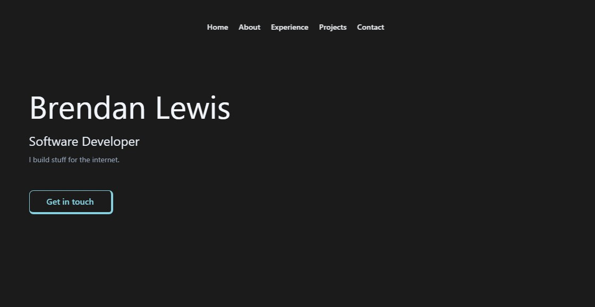

<h1 align="center">
    Brendan Lewis
</h1>
<p align="center">
    My newest portfolio. First of <a href="https://brendanjflewis.com/">brendanjflewis.com</a> built with <a href="https://nextjs.org/">Next.js</a> and deployed with <a href="https://vercel.com/">Vercel</a>.
</p>

<p align="center">
    
</p>

## Some Info on this App

This is a work in progress. This is an early version of this app. It's not quite at 1.0 yet, but I feel it is ready to show and share. You can find a roadmap of issues I plan to address in the [issues tab of this repo](https://github.com/brendanjflewis/portfolio-v3/issues). Thanks for taking a look!

## Installation & Set Up

1. Install dependencies

```sh
npm i
```

2. Start the development server

``` sh
npm run dev
```

## Questions

Email me at <a href= "mailto: brendanjflewis@icloud.com">brendanjflewis@icloud.com</a>

You can check out my full Github profile at <a href= "https://www.github.com/brendanjflewis">brendanjflewis</a>